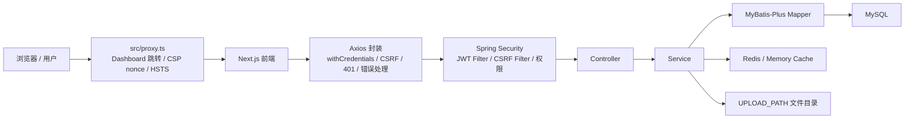

# 架构和模块说明

这份文档用于回答三个问题：

1. 这个项目整体怎么分层？
2. 一个请求从前端到数据库怎么流转？
3. 后续新增功能时应该放在哪些目录？

## 1. 总体架构



一句话版：

```text
前端负责展示和调用接口，后端负责认证授权和业务规则，Mapper 负责数据库，Redis/内存缓存负责验证码、限流和 Token 状态，文件系统负责上传文件。
```

## 2. 后端分层

后端根包：

```text
com.csa.official
```

启动类：

```text
CsaOfficialApplication.java
```

因为启动类位于 `com.csa.official`，Spring Boot 默认扫描它下面的所有子包：

```text
common
config
modules
```

### 2.1 common

`common` 放跨模块复用的能力。

| 子包 | 职责 | 典型类 |
| --- | --- | --- |
| `annotation` | 自定义注解 | `RateLimit`、`LogContribution` |
| `aspect` | 横切逻辑 | `RateLimitAspect`、`ContributionAspect` |
| `cache` | 缓存抽象 | `KeyValueStore`、`RedisKeyValueStore`、`MemoryKeyValueStore` |
| `constant` | 全局常量 | `RoleConsts` |
| `controller` | 通用接口 | `FileController`、`StoredFileController` |
| `exception` | 异常 | `CsaException`、`GlobalExceptionHandler` |
| `result` | 统一返回 | `R<T>` |
| `security` | 安全辅助 | `CsrfTokenService`、`JwtRevocationService`、`SecurityResponseWriter` |
| `util` | 工具 | `JwtUtils`、`SecurityUtils`、`PageUtils`（分页参数收敛） |

什么时候放 common：

- 多个业务模块都会用。
- 不属于某一个业务模块。
- 适合作为基础设施。

不要把具体业务逻辑放 common。比如“任命部长”应该在 `DeptService`，不是 common。

### 2.2 config

`config` 放项目启动时需要加载的配置。

| 类 | 作用 |
| --- | --- |
| `SecurityConfig` | Spring Security 过滤器链、放行路径、权限异常处理 |
| `JwtAuthenticationFilter` | 从 Bearer 或 Cookie 中解析 JWT |
| `CsrfProtectionFilter` | 对 Cookie 登录的非安全请求校验 CSRF |
| `CorsConfig` | 配置允许跨域的前端地址 |
| `RedisConfig` | Redis 序列化和连接相关配置 |
| `CacheConfig` | 根据 `CSA_CACHE_TYPE` 选择缓存实现 |
| `MemoryCacheConfig` | 本地内存缓存 Bean |
| `MybatisPlusConfig` | MyBatis-Plus 分页等配置 |
| `SwaggerConfig` | Knife4j/OpenAPI 文档，默认由 `SWAGGER_ENABLED=false` 关闭 |
| `SecurityStartupValidator` | 启动时校验 Cookie 安全配置 |
| `WebMvcConfig` | Web MVC 相关配置 |
| `AsyncConfig` | 两个相互隔离的异步线程池：`mailTaskExecutor`（邮件发送）、`contributionTaskExecutor`（贡献记录落库），均用 CallerRunsPolicy 兜底 |

### 2.3 modules

`modules` 放业务模块。

```text
modules
├─ sys
├─ biz
└─ resume
```

| 模块 | 职责 |
| --- | --- |
| `sys` | 用户、部门、资源、投票、贡献、配置、轮播图、导出 |
| `biz` | 竞赛、竞赛编辑者、Git 相关能力 |
| `resume` | 简历保存、提交、审核 |

每个模块通常包含：

```text
controller
service
mapper
entity
dto
vo
enums
```

当前项目并不是每个模块都完全按这个结构展开：请求 DTO 多数仍以 Controller 内部类形式存在；响应 VO 经过本轮重构已覆盖资源、竞赛、部门、轮播、提案、用户等模块，简历接口也已补上 `ResumeVO`。后续可以继续把请求 DTO 独立出来。

## 3. 前端分层

前端核心目录：

```text
src
├─ app
├─ components
├─ config
├─ hooks
├─ lib
├─ services
├─ store
├─ types
└─ proxy.ts
```

### 3.1 app

`src/app` 是 Next.js App Router 页面。

```text
/
/about
/competitions
/contributors
/resources
/login
/register
/dashboard
/dashboard/profile
/dashboard/resources
/dashboard/competitions
/dashboard/resume
/dashboard/departments
/dashboard/vote
/dashboard/settings
```

页面文件主要负责组合组件，不应该塞太多业务请求和复杂状态。

### 3.2 components

`components` 分三类：

| 目录 | 说明 |
| --- | --- |
| `components/ui` | Button、Input、Card、Dialog 等基础组件 |
| `components/layout` | Navbar、Footer、DashboardSidebar、DashboardGuard |
| `components/business` | 具体业务组件，如 ResourceLibrary、ProposalCenter |

### 3.3 services

`src/services` 是前后端契约层。

好处：

- 页面不直接写 URL。
- API 参数和返回类型集中。
- 后端路径变化时修改 service 即可。

### 3.4 lib

`src/lib` 放通用逻辑：

| 文件 | 作用 |
| --- | --- |
| `axios.ts` | API 实例、CSRF、401 跳转、错误包装 |
| `access.ts` | 角色标签、角色说明、权限判断 |
| `format.ts` | 格式化展示 |
| `navigation.ts` | 安全跳转 |
| `sanitize-html.ts` | 基于 isomorphic-dompurify 的前端展示/预览 HTML 清洗 |
| `utils.ts` | className 合并等工具 |

### 3.5 store

`useAuthStore.ts` 保存：

- `user`
- `setLogin`
- `setUser`
- `logout`

注意：当前持久化只保存用户信息，不持久化 token。真正认证依赖 `CSA_AUTH_TOKEN` HttpOnly Cookie；登录接口响应体不返回 JWT token。

## 4. 请求流转

### 4.1 公开接口流转

例：协会介绍。

```text
/about 页面
→ publicService.getAbout
→ GET /api/public/about
→ SecurityConfig permitAll
→ PublicController.getAbout
→ SysConfigMapper.selectOne
→ R.ok(content)
→ Axios 拆包
→ 页面渲染
```

### 4.2 登录接口流转

```text
LoginForm
→ authService.login
→ POST /api/auth/login
→ AuthController.login
→ AuthenticationManager.authenticate
→ UserDetailsServiceImpl.loadUserByUsername
→ PasswordEncoder 校验
→ JwtUtils.generateToken
→ CsrfTokenService.generateToken
→ Set-Cookie: CSA_AUTH_TOKEN(HttpOnly)
→ Set-Cookie: CSA_CSRF_TOKEN
→ R.ok(csrfToken + username + roleLevel)
→ rememberCsrfToken
→ useAuthStore.setLogin
```

### 4.3 需要登录的 GET

例：当前用户信息。

```text
DashboardGuard
→ userService.getInfo
→ GET /api/sys/user/info
→ JwtAuthenticationFilter 解析 Cookie；后端也兼容 Authorization Bearer
→ SecurityContext 写入 Authentication
→ SysUserController.getUserInfo
→ SecurityUtils.getCurrentUser
→ UserInfoVO
```

### 4.4 需要 CSRF 的 POST

例：退出登录。

```text
Navbar.handleLogout
→ authService.logout
→ POST /api/auth/logout
→ Axios 判断非安全方法
→ ensureCsrfToken
→ Header: X-CSRF-Token
→ JwtAuthenticationFilter 解析 Cookie
→ CsrfProtectionFilter 校验 Cookie/Header
→ AuthController.logout
→ JwtRevocationService.revoke
→ 清理 Cookie
```

## 5. 关键设计点

### 5.1 为什么要统一返回

统一返回的好处：

- 前端只写一套拆包逻辑。
- 错误提示格式统一。
- 测试更容易断言。
- 接口文档更清晰。

### 5.2 为什么要全局异常

如果每个 Controller 都写 try-catch，会有几个问题：

- 重复代码多。
- 错误格式容易不一致。
- 容易把堆栈信息返回给前端。
- 很难统一记录日志。

`GlobalExceptionHandler` 集中处理参数错误、业务异常、权限异常、文件超限、重复键和未知异常。

### 5.3 为什么 Controller 不直接写 SQL

Controller 应该负责：

- 接收参数。
- 调用 Service。
- 返回结果。
- 写少量接口级校验。

Service 应该负责：

- 业务规则。
- 事务。
- 多表协作。
- 权限辅助判断。

Mapper 应该负责：

- 数据库 CRUD。
- 条件查询。

这样以后把同一业务暴露给 Agent 工具时，可以复用 Service，而不是复制 Controller 里的逻辑。

### 5.4 为什么需要 DTO/VO

Entity 是数据库结构，不一定适合直接暴露给前端。

DTO 用来接请求：

```text
SaveResourceDto
LoginDto
RegisterDto
ExportDto
```

VO 用来返回前端：

```text
UserInfoVO
UserDirectoryVO
ResourceVO
ProposalVO
DeptVO
CarouselVO
CompetitionListVO
CompetitionDetailVO
```

好处：

- 避免敏感字段泄露，如 password。
- 接口字段可以稳定，不被数据库结构绑死。
- 可以聚合部门名、角色标签等展示字段。

### 5.5 Controller 不再直接持有 Mapper（资源模块）

`ResourceController` 原来有 148 行，自己注入 `ResourceMapper`，把分页查询、资源归属校验、下载计数全写在 Controller 里。这带来三个问题：

- Controller 加不了事务。而更新分支是「先 `selectById` 做归属校验、再 `updateById`」的读-判断-写序列，需要放在同一个事务里，否则中途资源被删会出现校验通过但更新落空。
- 业务规则被 Web 层绑死，后续 Agent 工具想复用只能复制。
- 单元测试必须起 Web 环境。

现在这段逻辑搬到了 `ResourceService`：它带 `@Transactional`，`ResourceServiceTest` 不用 MockMvc 就能直接测；Controller 只剩接参数、调 Service、返回。

需要说明的是，本轮只重构了资源模块，其它 Controller 目前仍直接持有 Mapper，文档不夸大：

- `CarouselController` 直接用 `CarouselMapper`。
- `ContributionController` 的公开贡献墙仍直接使用 `ContributionLogMapper`；人工补录和管理历史已下沉到 `ContributionService`。
- `VoteController` 只有创建/投票走 `VoteService`，列表查询仍直接用 `ProposalMapper`（部分未拆）。
- `PublicController` 直接用 `SysConfigMapper`、`UserMapper`、`DeptMapper`。
- `SysUserController`、`AuthController` 也仍直接用 Mapper。

这些是后续可以继续下沉到 Service 的点。

### 5.6 Entity 不再直接出现在响应里

资源、提案、部门、轮播、简历接口现在返回 VO（`ResourceVO`、`ProposalVO`、`DeptVO`、`CarouselVO`、`ResumeVO`），不再把 Entity 直接丢给前端。

原因：Entity 里有 `deleted` 这类逻辑删除列和其它持久化细节，不应该泄进 API 契约；而且一旦以后给某张表加了一列，如果直接返回 Entity，接口字段会被悄悄拓宽，前端和文档都不知情。用 VO 就把「数据库结构」和「接口契约」解耦了，加列不会自动改接口。

补 `ResumeVO` 的过程中还带出一个真实存在的契约 bug，值得单独记一笔：

Jackson 默认把 Java 枚举序列化成**名字**，所以 `Resume.status` 出去是 `"APPROVED"` 而不是 `2`。
注意 `@EnumValue` 是 MyBatis-Plus 的注解，只决定「怎么存进数据库」，
对「怎么序列化成 JSON」没有任何影响 —— 这两件事经常被混为一谈。

而前端 `services/resume.ts` 声明的是 `status: number`，用 `RESUME_STATUS.APPROVED === 2` 比较，
字符串永远等不上数字，导致简历页状态标签一直显示成「草稿」。

同一个根因在竞赛模块表现完全不同：列表显示没问题（兼容函数同时处理了数字和枚举名），
但编辑弹窗回填状态时用 `Number.parseInt(String(status)) || 1`，
遇到 `"FINISHED"` 会得到 `NaN` 再回退成 `1` ——
只是改个标题，保存后状态会被悄悄从「已结束」改成「进行中」。

修法是在 VO 层显式返回 `code`（`ResumeVO.status`、`CompetitionListVO.status`、
`CompetitionDetailVO.status` 都改成 `Integer`），不动枚举本身、也不动请求反序列化那条路径。
之所以不给枚举加 `@JsonValue`，是因为它会连带影响反序列化，
而 `SaveCompetitionDto` 现在接收数字是靠 Jackson「按 ordinal 索引」的行为
（该枚举恰好 ordinal 与 code 相等），改动面更大。
`ResumeVOTest` 和 `CompetitionServiceTest.detailReturnsNumericStatusCodeNotEnumName` 把这条契约钉住了。

### 5.7 列表与详情拆开

竞赛列表项原来带完整的 `content` 富文本正文，一页 10 条可能传几百 KB，其中 99% 前端在列表页根本不显示。

现在 `CompetitionListVO` 用 `summary` 替代 `content`：`summary` 是把正文用 Jsoup 剥掉标签、再截到 200 字的纯文本摘要（用 Jsoup 而不是直接 `substring`，避免从 HTML 标签中间切断）。完整正文改由两个新的详情接口按 id 单独取：

- `GET /api/biz/comp/{id}` → 后台详情，返回 `CompetitionDetailVO`。
- `GET /api/public/competitions/{id}` → 公开详情，未发布竞赛在这里返回 404，不泄露给未登录用户。

前端的编辑弹窗现在按需拉详情，而不是让列表接口顺带把每条正文都传下来。

### 5.8 贡献记录异步化

`ContributionAspect` 原来在 `@AfterReturning` 里同步 `INSERT`，等于给每个被 `@LogContribution` 切到的写接口都额外挂一次数据库往返，拖长了接口 RT。

现在切面只在请求线程上做一件事：取 `userId`。这一步的关键在于——`SecurityContext` 默认是 ThreadLocal，异步线程里取不到当前登录用户，所以必须在请求线程先拿好再往下传。取到后把实际写库交给 `ContributionLogWriter`，它跑在专用的 `contributionTaskExecutor` 线程池上，用 CallerRunsPolicy：队列满时退化为同步写，宁可慢也不丢记录。自动记录写入 `source=AUTO`。

`ContributionLogWriter` 之所以单独成一个 Bean（而不是把 `@Async` 加在切面里），和已有的 `AsyncMailSender` 是同一个道理：`@Async` 走 Spring 代理，同类内部自调用会绕过代理不生效，必须从外部 Bean 调进来。

### 5.8.1 人工贡献记录闭环

旧版本虽然已经有 `POST /api/sys/contribution/award`，但只有 API 调试工具能调用，缺少成员选择、历史查询和操作追踪。现在 `ContributionController` 只负责 HTTP 边界，`ContributionService` 负责：

1. 校验成员存在、未删除且处于 `ACTIVE` 状态。
2. 校验 `DEV/RES/COMP/OPS` 类型、正分值和说明长度。
3. 在事务中写入 `source=MANUAL` 和 `awarded_by`。
4. 记录不含贡献说明正文的管理审计事件，避免审计日志重复保存个人输入。
5. 分页查询流水后批量加载成员和部门，避免管理历史产生 N+1 查询。

前端 `/dashboard/contributions` 先调用成员目录搜索，再提交人工记录，并默认按 `MANUAL` 查看历史；`AUTO` 和 `LEGACY` 可用于核对自动流水及迁移前数据。

### 5.9 分页上限统一（PageUtils）

以前资源、竞赛列表的 `size` 没有上限，攻击者请求 `?size=1000000` 就能让数据库一次吐出全表、把堆打满；而其它 Controller 各写各的 `Math.min(size, 200)`，上限还不一致。

现在统一走 `PageUtils`：分页接口用 `PageUtils.of(page, size)`（默认每页 10，上限 100），不分页的列表用 `PageUtils.clampLimit(...)`（上限 200）。上限收敛在一处，不再散落各个 Controller。

### 5.10 数据库结构进入版本控制

生产数据库结构的唯一执行入口是 `csa-official-backend/src/main/resources/db/migration/` 下的 Flyway 版本链：当前版本为 V1-V5，V5 为贡献来源和操作人迁移。根目录的 `db/schema.sql` 保留为学习用结构快照，`db/seed.sql` 只允许 dev/test 在显式运行时口令下加载，不能当作生产迁移。

一个刻意的决定是**不建物理外键**：项目用逻辑删除（父行 `deleted=1` 但物理仍在）+ MyBatis-Plus，物理外键会和逻辑删除、框架的级联行为互相打架，所以表间关系只用注释描述，不加 `FOREIGN KEY` 约束（详见 `docs/database.md`）。

配套的 `SchemaConsistencyTest` 会把每个 Entity 的字段转成下划线列名，和全部 Flyway migration 解析出的列做双向 diff：只要某个 Entity 加了字段却忘了同步迁移，构建期测试就会失败——把「换台机器初始化数据库时才在运行时报 `Unknown column`」这个很难当场发现的问题，提前到测试阶段拦住。

## 6. 模块详解

### 6.1 sys 模块

`sys` 是当前最大的模块。

| 子功能 | Controller | Service/Mapper |
| --- | --- | --- |
| 登录注册 | `AuthController` | `MailService`、`UserMapper`、`InviteCodeMapper` |
| 用户 | `SysUserController` | `UserMapper`、`DeptMapper` |
| 部门 | `DeptController` | `DeptService` |
| 资源 | `ResourceController` | `ResourceService`、`ResourceMapper` |
| 轮播图 | `CarouselController` | `CarouselMapper`（Controller 直接持有） |
| 贡献 | `ContributionController` | `ContributionService`、`ContributionLogMapper`；自动记录经 `ContributionAspect` → `ContributionLogWriter` 异步落库 |
| 投票 | `VoteController` | `VoteService`、`ProposalMapper` |
| 导出 | `ExportController` | `UserExportService` |
| 公开内容 | `PublicController` | `SysConfigMapper` |

### 6.2 biz 模块

`biz` 目前主要是竞赛。

重点设计：

- `CompetitionController` 是后台管理接口。
- `PublicCompetitionController` 是公开接口。
- `CompetitionService` 处理分页、保存、授权编辑者、摘要生成。
- `CsaSecurityService` 参与权限表达式判断。
- 列表接口返回 `CompetitionListVO`（只带摘要 `summary`），完整正文走 `GET /{id}` 详情接口返回 `CompetitionDetailVO`。

### 6.3 resume 模块

`resume` 是简历投递。

重点设计：

- Level 2 以上可以维护自己的简历。
- Level 3 以上可以审核。
- Service 负责状态变化。

## 7. 新增功能应该怎么放

以“活动报名模块”为例。

后端建议：

```text
modules/activity
├─ controller
│  └─ ActivityController.java
├─ service
│  └─ ActivityService.java
├─ mapper
│  ├─ ActivityMapper.java
│  └─ ActivityRegistrationMapper.java
├─ entity
│  ├─ Activity.java
│  └─ ActivityRegistration.java
├─ dto
│  ├─ ActivitySaveDTO.java
│  └─ RegisterActivityDTO.java
└─ vo
   ├─ ActivityListVO.java
   └─ MyRegistrationVO.java
```

前端建议：

```text
src/app/activities/page.tsx
src/app/dashboard/activities/page.tsx
src/components/business/activities/ActivityBoard.tsx
src/services/activity.ts
src/types/activity.ts
```

权限建议：

- 公开活动列表：`/api/public/activities`
- 报名：登录用户。
- 创建/编辑活动：Level 3 以上。
- 导出报名名单：Level 4 以上。

## 8. 当前架构的后续优化点

本轮已落地（对照原优化点）：

- 列表接口统一最大 `size`：分页走 `PageUtils.of`（上限 100），非分页列表走 `PageUtils.clampLimit`（上限 200）。
- 资源、竞赛、部门、轮播、提案、简历返回改为 VO，不再直接返回 Entity（详见 5.6）。
- 保留 `db/schema.sql` 学习结构快照，生产结构由 Flyway V1-V5 管理，并用 `SchemaConsistencyTest` 防止实体与 migration 漂移。

仍待推进：

1. 把 Controller 内部 DTO 拆到 `dto` 包，方便复用和测试。
2. 把仍直接持有 Mapper 的 Controller（轮播、公开内容、投票列表、用户、注册等）继续下沉到 Service。
3. 为简历审核、Git 同步、审计、成员导出和贡献管理补真实账号 Playwright E2E。
4. 补账号删除审批、数据保留核验和匿名化恢复演练；当前不做不可恢复的物理删除。
5. 在健康 staging 环境补跑当前镜像、Playwright、备份恢复和 Trivy 验证。
6. 接入 RAG 后，把知识库模块单独放 `modules/kb`。
6. 接入 Agent 后，把工具调用和审计单独放 `modules/agent`。
