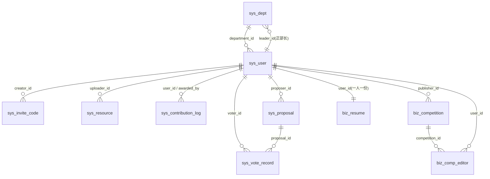

# 数据库结构说明

这份文档用于回答四个问题：

1. 一共有哪些表，各自属于哪个模块、干什么用？
2. 表和表之间是什么关系？
3. 每个索引是为哪个查询服务的？
4. 怎么初始化数据库？

配套文件：

```text
csa-official-backend/src/main/resources/db/migration/V1__initial_schema.sql  初始结构
csa-official-backend/src/main/resources/db/migration/V2__production_operations.sql  Phase 2 运营结构
csa-official-backend/src/main/resources/db/migration/V3__resume_review_queue_index.sql  简历审核队列索引
csa-official-backend/src/main/resources/db/migration/V4__account_storage_and_git_sync.sql  账号、文件配额和 Git 同步
csa-official-backend/src/main/resources/db/migration/V5__contribution_award_audit.sql  贡献来源和操作人
db/schema.sql   历史/本地结构参考，不是生产迁移入口
db/seed.sql     仅 dev/test 演示种子
```

生产结构由 Flyway 按版本执行。迁移不创建数据库、不切换 `USE`，数据库和应用用户必须由部署系统预先创建。结构与 MyBatis-Plus 实体类（`modules/**/entity/*.java`）保持一致：表名取自 `@TableName`，列名是 Java 字段的 snake_case（`application.yml` 开启 `map-underscore-to-camel-case: true`），主键均为 `@TableId(type = IdType.AUTO)` 对应的 `BIGINT AUTO_INCREMENT`。

## 1. 表清单

| 表名 | 用途 | 所属模块 | 实体类 |
| --- | --- | --- | --- |
| `sys_user` | 用户账号、权限等级、职位、学籍、余额 | sys | `User` |
| `sys_dept` | 部门及正部长 | sys | `Dept` |
| `sys_carousel` | 首页轮播图 | sys | `Carousel` |
| `sys_invite_code` | 注册邀请码 | sys | `InviteCode` |
| `sys_proposal` | 投票提案 | sys | `Proposal` |
| `sys_vote_record` | 投票记录 | sys | `VoteRecord` |
| `sys_resource` | 资源库 | sys | `Resource` |
| `sys_contribution_log` | 贡献流水、人工补录来源和操作人 | sys | `ContributionLog` |
| `sys_config` | 系统配置（如协会介绍 CSA_INTRO） | sys | `SysConfig` |
| `biz_competition` | 竞赛 | biz | `Competition` |
| `biz_comp_editor` | 竞赛授权编辑者 | biz | `CompEditor` |
| `biz_resume` | 简历投递与审核 | resume | `Resume` |
| `sys_audit_log` | 管理与安全审计事件 | sys | `AuditLog` |
| `sys_stored_file` | 上传文件元数据、配额和孤儿清理依据 | sys | `StoredFile` |
| `sys_mail_delivery` | 邮件发送状态与有限重试记录 | sys | `MailDelivery` |
| `sys_scheduled_job_execution` | 定时任务幂等键与执行状态 | sys | `ScheduledJobExecution` |

## 2. 表间关系（ER 说明）

本项目【不建物理外键】，下面的关系都是逻辑关联，靠应用层维护。



文字版：

- 一个部门（`sys_dept`）有多个用户（`sys_user.department_id`）；部门的正部长通过 `sys_dept.leader_id` 指回用户。
- 一个提案（`sys_proposal`）有多条投票记录（`sys_vote_record.proposal_id`），每个用户对同一提案最多投一次。
- 一个竞赛（`biz_competition`）可授权多个编辑者（`biz_comp_editor`），同一竞赛不重复授权同一人。
- 一个用户最多一份简历（`biz_resume.user_id` 唯一）。
- 贡献流水（`sys_contribution_log`）按 `user_id` 聚合成贡献墙；`awarded_by` 记录人工操作人或触发自动记录的用户。

### 2.1 为什么不建物理外键

项目采用**逻辑删除**（`@TableLogic private Integer deleted`）+ MyBatis-Plus，物理外键会带来两类冲突：

1. 逻辑删除时父行只是 `deleted=1`，物理记录仍在，物理外键无法表达“逻辑上已删除”的语义，反而会阻止或误导级联。
2. MyBatis-Plus 的写入/删除是按框架规则走的，物理外键的级联/限制会和框架行为打架，增加不可控性。

因此表结构中只用注释标注逻辑关联（`-- 逻辑关联 xxx.id`），由 Service 层保证一致性。这也是贡献墙 SQL 里显式写 `AND (u.deleted = 0 OR u.deleted IS NULL)` 手动过滤逻辑删除的原因。

## 3. 审计字段与逻辑删除约定

三类“可选列”严格按实体注解决定，不能一刀切：

- `deleted`：仅当实体声明 `@TableLogic private Integer deleted` 才有。统一 `TINYINT NOT NULL DEFAULT 0`（0 正常 / 1 删除）。
- `create_time`：仅当字段标注 `@TableField(fill = FieldFill.INSERT)`。
- `update_time`：仅当字段标注 `@TableField(fill = FieldFill.INSERT_UPDATE)`。

各表实际拥有情况：

| 表 | create_time | update_time | deleted |
| --- | :---: | :---: | :---: |
| `sys_user` | ✓ | ✓ | ✓ |
| `sys_dept` | ✓ | ✓ | ✓ |
| `sys_carousel` | ✓ | ✓ | ✓ |
| `sys_invite_code` | ✓ | ✗ | ✓ |
| `sys_proposal` | ✓ | ✓ | ✓ |
| `sys_resource` | ✓ | ✗ | ✓ |
| `sys_config` | ✗ | ✓ | ✗ |
| `sys_vote_record` | ✓ | ✗ | ✗ |
| `sys_contribution_log` | ✓ | ✗ | ✗ |
| `biz_competition` | ✓ | ✓ | ✓ |
| `biz_comp_editor` | ✗ | ✗ | ✗ |
| `biz_resume` | ✓ | ✓ | ✓ |

时间列由 MyBatis-Plus 的 `MetaObjectHandler` 自动填充；`schema.sql` 额外给了 `DEFAULT CURRENT_TIMESTAMP` 作为手工 SQL 的兜底，二者不冲突。

## 4. 枚举字段的存储类型

`CompetitionStatusEnum` / `ResumeStatusEnum` / `VoteResultEnum` 三个枚举都在 `int code` 字段上标注了 `@EnumValue`（不是 `IEnum`，但效果相同：MyBatis-Plus 落库时存 `@EnumValue` 标注的值）。因此对应列用 **INT 存整数 code**，而不是 VARCHAR 存枚举名。

| 列 | 枚举 | 取值 |
| --- | --- | --- |
| `biz_competition.status` | `CompetitionStatusEnum` | 0 未发布 / 1 进行中 / 2 已结束 |
| `biz_resume.status` | `ResumeStatusEnum` | 0 草稿 / 1 待审核 / 2 已通过 / 3 已驳回 |
| `sys_vote_record.result` | `VoteResultEnum` | 0 反对 / 1 赞成 |

**反例（易踩坑）**：`sys_contribution_log.type` 不是枚举列，实体里就是 `private String type`，直接存枚举**名字符串** `'DEV' / 'RES' / 'COMP' / 'OPS'`，所以用 **VARCHAR**。贡献墙 SQL 里也是按 `l.type = 'DEV'` 这样比对字符串的。

`sys_contribution_log.source` 取值为 `AUTO`、`MANUAL` 或 `LEGACY`。V5 迁移不会猜测旧记录来源，历史行统一保留为 `LEGACY`；人工记录另外保存 `awarded_by`，便于管理页面和审计追踪。

其余 `sys_proposal.status`、`sys_carousel.status` 是普通 `Integer`（非枚举），同样用 INT。

## 5. 索引设计（每个索引服务哪个查询）

索引都是从**真实查询模式**反推的，不是凭空加的。

| 表 | 索引 | 类型 | 服务的查询 |
| --- | --- | --- | --- |
| `sys_user` | `uk_user_username (username)` | UNIQUE | 注册查重 `AuthController.exists(username)`、登录 `SecurityUtils.selectOne(username)` |
| `sys_user` | `idx_user_email (email)` | 普通 | 按邮箱查询用户（找回/校验） |
| `sys_user` | `idx_user_department (department_id)` | 普通 | 用户目录按部门筛选 `SysUserController.query.eq(departmentId)` |
| `sys_user` | `idx_user_role_level (role_level)` | 普通 | `/public/contributors` 过滤 `role_level >= 2` 并按 `role_level DESC` 排序 |
| `sys_resource` | `idx_resource_category_time (category, create_time)` | 普通 | 资源列表按 `category` 过滤并按 `create_time DESC` 排序 |
| `biz_competition` | `idx_comp_status_time (status, update_time, create_time)` | 普通 | 公开列表过滤 `status <> 0(UNPUBLISHED)` 并按 `update_time DESC, create_time DESC` 排序 |
| `biz_comp_editor` | `uk_editor_comp_user (competition_id, user_id)` | UNIQUE | `CompetitionService.addEditor` 用 `exists(competition_id, user_id)` 查重，唯一约束把“同一竞赛不重复授权同一人”下沉到 DB |
| `sys_contribution_log` | `idx_contrib_user_type (user_id, type)` | 普通 | 贡献墙 `selectWall` 按 `user_id` 分组、对 `type` 做条件聚合 |
| `sys_contribution_log` | `idx_contribution_admin_history (source, create_time, id)` | 普通 | `/api/sys/contribution/awards` 按来源和时间分页查询管理流水 |
| `sys_vote_record` | `uk_vote_proposal_voter (proposal_id, voter_id)` | UNIQUE | 防重复投票，见下方 5.1 |
| `biz_resume` | `uk_resume_user (user_id)` | UNIQUE | `ResumeService.getMyResume` 用 `selectOne(user_id)`，唯一避免多行导致 `TooManyResultsException` |
| `sys_config` | `uk_config_key (config_key)` | UNIQUE | 按键取配置 `selectOne(config_key)`（如 `CSA_INTRO`），保证一键一值 |
| `sys_invite_code` | `uk_invite_code (code)` | UNIQUE | 注册核销邀请码 `selectOne(code)` |
| `sys_carousel` | `idx_carousel_status_sort (status, sort_order, create_time)` | 普通 | 首页轮播过滤 `status=1` 并按 `sort_order ASC, create_time DESC` 排序 |
| `sys_proposal` | `idx_proposal_create_time (create_time)` | 普通 | 提案列表按 `create_time DESC` 排序 |

### 5.1 投票唯一约束的依据

`sys_vote_record` 用了 **UNIQUE (proposal_id, voter_id)**，而不是普通索引。依据来自 `modules/sys/service/VoteService.java`：

```java
if (voteRecordMapper.exists(new LambdaQueryWrapper<VoteRecord>()
        .eq(VoteRecord::getProposalId, proposalId)
        .eq(VoteRecord::getVoterId, userId))) {
    throw new CsaException("You have already voted");
}
```

代码明确把“同一提案重复投票”当作错误抛出，说明业务语义就是“一人一票”。因此加唯一约束是安全的，还能在并发下兜底防止重复插入。

## 6. 初始化与迁移

### 6.1 生产与普通启动

应用启动时 Flyway 自动执行 `V1`-`V5` 等未执行迁移：

```bash
cd csa-official-backend
./mvnw spring-boot:run
```

生产必须把 `DB_URL`、`DB_USERNAME`、`DB_PASSWORD` 和 `JWT_SECRET` 等变量注入运行环境；不要把密码写进命令历史或仓库。迁移过程、已有库 baseline 和失败迁移处理见 [`production-readiness/flyway.md`](production-readiness/flyway.md)。

### 6.2 仅 dev/test 的演示 seed

`db/seed.sql` 不是生产初始化脚本。只有在 `dev`/`test` profile 且显式设置 `DEMO_SEED_ENABLED=true`、`DEMO_SEED_PASSWORD` 时，启动器才会在内存中把运行时密码哈希写入演示数据。密码由运行命令或 CI 临时生成，本文不记录固定口令。

如果手动操作数据库，先确认数据库已存在，再执行迁移；不要直接把 `db/schema.sql` 当作生产升级脚本：

```bash
mysql -u <admin-user> -p -e 'CREATE DATABASE csa_db CHARACTER SET utf8mb4 COLLATE utf8mb4_unicode_ci;'
```

字符集统一 `utf8mb4 / utf8mb4_unicode_ci`，存储引擎 InnoDB。脚本用 `CREATE TABLE IF NOT EXISTS`，`seed.sql` 用显式主键 + `ON DUPLICATE KEY UPDATE`，均可重复执行。

### 6.3 演示账号

`seed.sql` 内置 6 个账号，覆盖全部权限等级。密码不是 SQL 固定值，而是由 dev/test 启动时的 `DEMO_SEED_PASSWORD` 生成 BCrypt 哈希；生产不会创建这些账号：

| 用户名 | 姓名 | role_level | 说明 |
| --- | --- | --- | --- |
| `root` | 超级管理员 | 99 | ROOT |
| `president` | 张会长 | 4 | 会长 |
| `minister` | 李部长 | 3 | 部长（技术部正部长） |
| `core` | 王核心 | 2 | 核心成员 |
| `member` | 赵会员 | 1 | 会员 |
| `guest` | 陈路人 | 0 | 路人 |

密码哈希由项目实际使用的 Spring Security `BCryptPasswordEncoder` 生成。验收时从进程环境读取临时密码，不要把它复制到日志、文档、测试或截图中。详见 `db/seed.sql` 文件头和 `DevSeedDataInitializer`。
