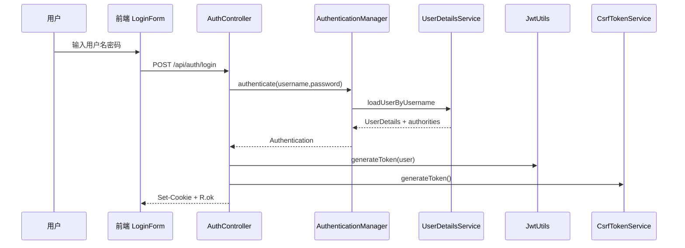

# 安全设计说明

这份文档专门解释项目里的登录、JWT、Cookie、CSRF、CORS、角色权限、会话吊销、账号生命周期、限流和文件访问控制。它适合用来面试讲解，也适合排查 401/403/500。

## 1. 安全目标

项目需要解决这些问题：

1. 用户是谁：认证 Authentication。
2. 用户能做什么：授权 Authorization。
3. Token 有没有被篡改：JWT 签名。
4. Token 退出后还能不能用：单 Token 吊销。
5. 修改密码或停用账号后其它设备还能不能用：`session_version` 全会话吊销和账号状态检查。
6. Cookie 登录会不会被 CSRF 利用：CSRF Token。
7. 前端域名能不能访问后端：CORS。
8. 接口会不会被刷：限流。
9. 上传文件会不会越权访问：文件访问控制。
10. 富文本会不会 XSS：HTML 白名单清洗。

## 2. 登录认证链路



登录成功后：

- 后端生成 JWT，但不把 JWT 放进响应体。
- 后端写 `CSA_AUTH_TOKEN` Cookie，HttpOnly。
- 后端写 `CSA_CSRF_TOKEN` Cookie，非 HttpOnly，并在响应体返回同一个 `csrfToken`。
- 响应体只返回 `csrfToken`、`username`、`roleLevel`。
- 前端保存 user 信息。
- 前端记住 csrfToken。

## 3. JWT 解析链路

每个请求都会经过 `JwtAuthenticationFilter`。

解析顺序：

1. 先看 `Authorization` Header。
2. 如果是 `Bearer xxx`，使用 Bearer Token。
3. 如果没有 Bearer，再看 Cookie。
4. 如果有 `CSA_AUTH_TOKEN`，使用 Cookie Token。
5. 校验 Token 是否过期。
6. 校验 Token 是否被吊销。
7. 解析 username 和 `sessionVersion` claim。
8. 加载 UserDetails，并比较数据库中的当前 `session_version`；缺少 claim 的旧 Token 直接失效。
9. 校验账号是否仍为可登录状态。
10. 写入 `SecurityContextHolder`。
11. 记录 Token 来源，用于后续 CSRF 判断。

为什么支持 Bearer 和 Cookie：

- 浏览器前端默认使用 Cookie，且不保存、不读取、不拼接 Bearer Token；HttpOnly Cookie 能降低 XSS 读取 Token 的风险。
- API 调试或非浏览器客户端适合 Bearer。

## 4. Cookie 策略

关键配置：

```yaml
csa:
  security:
    cookie:
      name: ${AUTH_COOKIE_NAME:CSA_AUTH_TOKEN}
      secure: ${AUTH_COOKIE_SECURE:false}
      same-site: ${AUTH_COOKIE_SAME_SITE:Lax}
```

本地开发：

```properties
AUTH_COOKIE_SECURE=false
AUTH_COOKIE_SAME_SITE=Lax
```

生产环境：

```properties
AUTH_COOKIE_SECURE=true
AUTH_COOKIE_SAME_SITE=None
```

如果前后端部署在不同站点，并且需要跨站 Cookie，通常要用：

```text
SameSite=None + Secure=true + HTTPS
```

项目里 `SecurityStartupValidator` 做了保护：

- `SameSite=None` 时，`Secure` 必须为 true。
- prod/production profile 下，认证 Cookie 必须 `Secure=true`。

## 5. CSRF 设计

为什么需要 CSRF：

- Cookie 会被浏览器自动带上。
- 如果恶意网站诱导用户请求你的后端，浏览器可能自动带登录 Cookie。
- 这时如果没有 CSRF 防护，攻击者可能让用户“在不知情的情况下发起写操作”。

项目的规则：

```text
GET / HEAD / OPTIONS / TRACE 不校验 CSRF
POST / PUT / PATCH / DELETE 需要校验
```

但有豁免：

```text
/api/auth/login
/api/auth/register
/api/auth/send-code
/api/auth/csrf
/api/public/**
```

还有一个关键设计：

```text
如果请求使用 Bearer Token，不走 CSRF 校验。
如果请求使用 Cookie Token，才校验 CSRF。
```

原因：

- CSRF 主要针对浏览器自动带 Cookie。
- Bearer Token 需要调用方主动设置 Header，恶意网页一般不能凭空拿到用户 Bearer Token。

校验方式：

```text
读取 Cookie: CSA_CSRF_TOKEN
读取 Header: X-CSRF-Token
比较两者是否匹配
```

## 6. CORS 设计

CORS 配置决定哪些前端地址可以访问后端。

配置：

```properties
CORS_ALLOWED_ORIGIN_PATTERNS=http://localhost:3000,http://127.0.0.1:3000
```

本地常见地址：

```text
http://localhost:3000
http://127.0.0.1:3000
http://localhost:3001
http://127.0.0.1:3001
```

如果浏览器报 CORS 错误，先检查：

1. 前端实际 origin 是什么。
2. 后端配置是否包含这个 origin。
3. 是否允许 credentials。
4. 前端 Axios 是否 `withCredentials: true`。

## 6.1 前端安全头

前端还有一层 `src/proxy.ts`：

- 访问 `/dashboard/**` 时，如果没有 `CSA_AUTH_TOKEN` Cookie，会跳转到 `/login?redirect=...`。
- 每次请求生成 nonce，并把 nonce 通过 `x-nonce` 传给页面。
- 设置 `Content-Security-Policy`，降低 XSS 成功后的脚本执行风险。
- 生产环境设置 `Strict-Transport-Security`。

这层不是后端权限控制，不能替代 `@PreAuthorize`，但能提前挡掉未登录访问并加固浏览器侧安全策略。

## 7. 角色权限

角色来源：

```text
User.roleLevel
→ UserDetailsServiceImpl
→ GrantedAuthority: ROLE_LEVEL_x
→ @PreAuthorize
```

角色等级：

| 等级 | 角色 | 说明 |
| --- | --- | --- |
| 0 | 游客 | 登录后最低等级 |
| 1 | 会员 | 资源库 |
| 2 | 核心成员 | 简历 |
| 3 | 部长 | 竞赛、资源发布、投票 |
| 4 | 会长 | 部门、公开设置、导出 |
| 99 | Root | 超级管理员 |

常见权限表达式：

```java
@PreAuthorize("hasRole('LEVEL_1')")
@PreAuthorize("hasRole('LEVEL_3')")
@PreAuthorize("hasRole('LEVEL_4')")
@PreAuthorize("@csaSec.canEditCompetition(#dto.id)")
```

前端菜单：

```text
src/config/menu.ts
```

只用于显示隐藏，不能当安全边界。

## 8. 401 和 403

| 状态 | 含义 | 例子 |
| --- | --- | --- |
| 401 | 未认证 | 没有 Token、Token 无效、Token 过期 |
| 403 | 已认证但无权限 | 普通会员调用部长接口 |
| 403 | CSRF 失败 | Cookie 登录的 POST 没有 CSRF Header |

前端处理：

- 401：清理登录态，跳转 `/login?redirect=...`。
- 403：抛 `ApiError`，由页面提示“无权访问”。

## 9. 限流设计

注解：

```java
@RateLimit(key = "login", time = 300, count = 10, identifiers = {"username"})
```

含义：

- 在 `time` 秒内。
- 同一个 key + IP + identifiers。
- 最多允许 `count` 次。

当前典型限流：

| 接口 | 时间 | 次数 | 维度 |
| --- | --- | --- | --- |
| 登录 | 300 秒 | 10 | username |
| 注册 | 60 秒 | 2 | username + email |
| 发送验证码 | 60 秒 | 1 | email |

为什么要限流：

- 防止暴力破解密码。
- 防止刷验证码邮件。
- 防止注册接口被滥用。
- 后续接 AI 接口时也能防止成本失控。

限流存储：

- `CSA_CACHE_TYPE=redis` 时用 Redis。
- `CSA_CACHE_TYPE=memory` 时用内存缓存。

## 10. Token 吊销与会话版本

JWT 的特点是无状态。无状态的好处是不用维护服务端 Session；坏处是签发后，在过期前理论上都能用。项目用两层机制处理不同范围的失效。

单个设备退出登录时使用：

```text
JwtRevocationService
```

退出登录时：

```text
AuthController.logout
→ resolveToken
→ jwtRevocationService.revoke(token)
→ 清理 Cookie
```

后续请求时：

```text
JwtAuthenticationFilter
→ !jwtRevocationService.isRevoked(token)
```

这样 Token 即使没过期，只要在黑名单里也不能用。

修改密码、重置密码、吊销全部会话、停用账号和提交删除申请时，`AccountService` 会原子递增用户的 `session_version`。新 JWT 会携带当前版本；`JwtAuthenticationFilter` 每次鉴权都比较 Token 与当前账号版本。旧 Token 即使不在 Redis 黑名单里，也会因为版本不一致而失效。

```text
POST /api/account/change-password
POST /api/account/revoke-sessions
POST /api/account/deactivate
POST /api/account/deletion-request
```

这些 Cookie 认证的 POST 都需要 CSRF。前三类会立即退出当前会话；删除申请只进入 `DELETION_PENDING` 和保留/审核流程，当前没有自动最终匿名化或物理删除执行器，不能把“提交申请”描述成“数据已经删除”。

## 11. 文件访问控制

上传：

```text
POST /api/common/file/upload
```

访问：

```text
GET /files/{ownerId}/{fileName}
```

访问规则：

1. 当前登录用户就是 owner：允许。
2. 文件已经作为资源发布：允许。
3. 否则拒绝。

为什么要这样：

- 用户上传的草稿文件不应该被别人直接猜路径下载。
- 已发布资源才可以被会员访问。
- 文件接口不能只是静态目录映射。

安全响应头：

```text
X-Content-Type-Options: nosniff
Content-Disposition: attachment
```

目的：

- 降低浏览器把文件当脚本执行的风险。
- 默认作为附件下载。

## 12. 富文本清洗

协会介绍允许富文本 HTML，但不能直接相信前端，也不能只相信后端已经清洗过的历史数据。

后端入库时使用：

```java
Jsoup.clean(content, ABOUT_CONTENT_SAFELIST)
```

前端展示和设置预览时使用：

```text
src/lib/sanitize-html.ts
→ isomorphic-dompurify
```

也就是说，当前是后端 Jsoup + 前端 DOMPurify 的双层清洗。

允许：

- 基础文本标签。
- 图片。
- 标题。
- blockquote。
- pre/code。
- a 标签 target/rel。

不允许：

- script。
- 内联危险事件。
- 未授权标签和属性。

这是为了防 XSS。

## 13. 安全测试覆盖

当前测试里已经覆盖了部分安全风险：

| 测试 | 关注点 |
| --- | --- |
| `SecurityErrorResponseTest` | 401/403 JSON 响应 |
| `AuthControllerRateLimitTest` | 登录/注册/验证码限流、注册提权防护 |
| `StoredFileControllerTest` | 文件访问权限 |
| `CompetitionControllerAuthorizationTest` | 竞赛编辑权限 |
| `JwtUtilsTest` | JWT 密钥长度、签名和过期时间 |
| `JwtAuthenticationFilterTest` | `sessionVersion` 缺失/过期、账号状态和鉴权依赖异常 |
| `AccountServiceTest` / `AccountControllerTest` | 改密、全会话吊销、停用、删除申请和 Cookie 清理 |
| `AuditServiceTest` | 密码、Token、Cookie 等敏感键不得进入审计 |
| `PersonalDataExportServiceTest` | 个人数据导出白名单和秘密字段负向断言 |
| `SecurityStartupValidatorTest` | SameSite/Secure 和生产 profile Cookie 配置 |
| `GitServiceTest` | JGit 相关逻辑的边界行为 |

这些单元和控制器测试不能替代真实浏览器验证。当前源码仍需在健康 staging 环境补跑 Playwright 登录、Cookie/CSRF、角色越权、上传和会话吊销流程。

## 14. 面试讲法

可以这样讲：

```text
我的项目使用 Spring Security + JWT 做认证授权。登录成功后，后端会签发 JWT，但不会把 token 放进响应体，而是只通过 HttpOnly Cookie 下发，降低 Token 被 XSS 读取的风险。因为 Cookie 会被浏览器自动携带，所以我额外做了 CSRF Token：非 GET 请求如果走 Cookie 认证，就要求 Cookie 中的 CSRF 和 Header 中的 X-CSRF-Token 匹配。JwtAuthenticationFilter 除了验签、过期和黑名单，还会比较 JWT 的 sessionVersion 与账号当前版本，并检查账号状态；改密、重置密码、全会话吊销、停用或删除申请都会让旧 Token 失效。Controller 再通过 @PreAuthorize 做角色控制。
```

如果被追问“前端隐藏按钮算不算权限控制”，回答：

```text
不算。前端隐藏只是用户体验，真正的权限必须在后端。因为用户可以直接构造 HTTP 请求绕过前端页面。所以我的后台接口都通过 Spring Security 和 @PreAuthorize 做后端校验。
```

如果被追问“为什么 Cookie 登录还要 CSRF”，回答：

```text
因为 Cookie 会被浏览器自动带上。攻击者虽然读不到 HttpOnly Cookie，但可以诱导浏览器发请求。如果没有 CSRF Token，用户在登录状态下访问恶意网页，恶意网页可能让浏览器向我的后端发起写操作。所以我要求 Cookie 登录的非安全方法带 X-CSRF-Token，并且和 CSRF Cookie 匹配。
```
